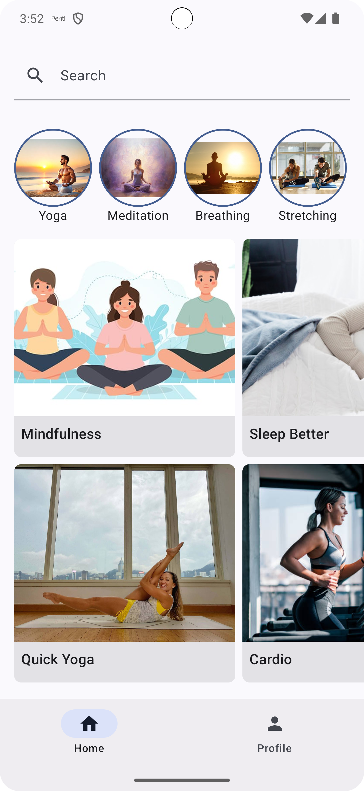
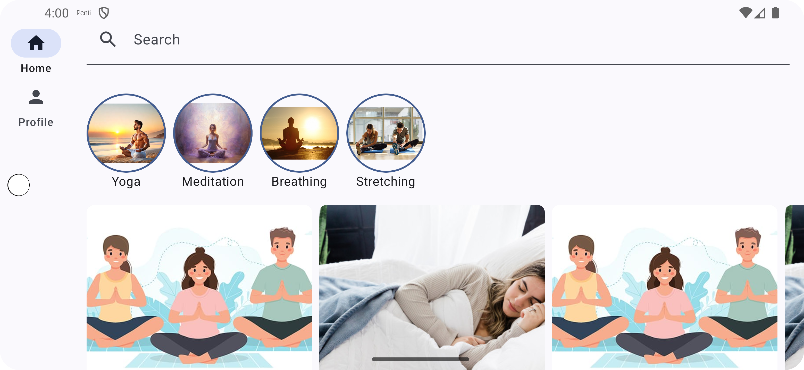

# 📱 FlowWell - An Android App with Jetpack Compose
<p align="center">
  
  
  
</p>

---

## 🌟 Overview

**FlowWell** is a practical Android application developed using **Jetpack Compose**. The app showcases how to create dynamic and responsive UIs with Compose while adhering to best practices for layouts, state management, navigation, and UI testing.

Jetpack Compose enables building UIs with a declarative approach, reducing boilerplate code, and improving readability, making Android development more efficient and fun!

---

## ✨ Features

- **Composable UI Elements**: Build a modern UI using Compose's declarative components.
- **Efficient State Management**: Seamless state handling using `remember` and `mutableStateOf`.
- **Navigation with NavController**: Easily navigate between screens with type-safe routes.
- **Responsive Layouts**: Create layouts that adapt to different screen sizes (portrait and landscape).
- **UI Testing with Jetpack Compose**: Test the UI components using Compose testing APIs.

---

## 🛠️ Setup & Installation

### Prerequisites

- **Android Studio** (Latest version recommended)
- **Kotlin** (v1.5.0 or later)
- **Jetpack Compose** libraries

### Steps to Get Started

1. **Clone the Repository**:
   ```bash
   git clone https://github.com/birdeveloper/flowwell.git
   cd flowwell
    ```
2.	Open the Project in Android Studio:
      •	Go to File > Open, and select the cloned flowwell directory.
      3.	Sync and Build the Project:
      •	Let Gradle sync the project dependencies.
      •	Once the build is complete, you’re ready to explore the code and run the app!

🧩 Project Structure

Here’s a quick overview of the main components in this project:

	•	ui/screens: Contains composable screens for the Home, Profile, and other app views.
	•	ui/components: Reusable UI components like SearchBar, CategoryRow, FeaturedCollectionsGrid.
	•	data: Provides sample data for testing and showcasing app features.
	•	navigation: Handles navigation between different screens using NavController.
	•	test/java/com/birdeveloper/flowwell: Includes UI and component tests to ensure the app’s behavior is correct.

📝 Article & Documentation

To learn more about how this app was built and to gain insights into building apps with Jetpack Compose, check out the full article below:


(https://gorkemkara.net/building-a-jetpack-compose-project-from-scratch-a-comprehensive-guide/)

📸 Screenshots
<p align="center">
  
  
</p>

🤖 Built With

	•	Kotlin - Modern, expressive, and type-safe programming language.
	•	Jetpack Compose - Android’s modern toolkit for building native UI.
	•	Navigation - A Compose library for navigating between screens.

🚀 Getting Involved

Contributions are welcome! Feel free to open an issue or submit a pull request to help improve this project.

📜 License

This project is licensed under the MIT License - see the LICENSE file for details.

<p align="center">Made with ❤️ by <a href="https://github.com/birdeveloper">Görkem KARA</a></p>
```
